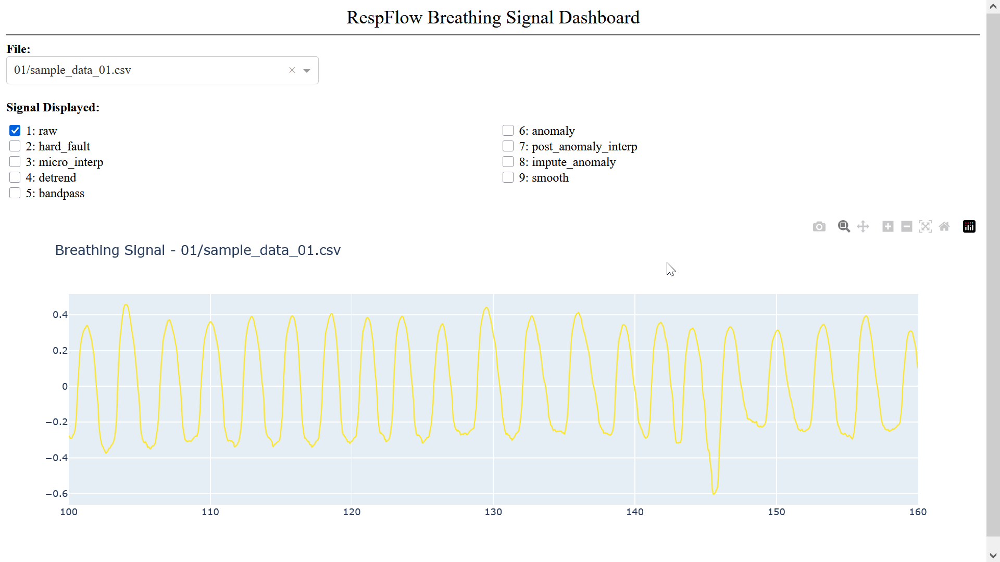

# RespFlow

A Python package for preprocessing and feature extraction of respiration signals for Respiratory Inductance Plethysmography (RIP) belts.

_RespFlow_ streamlines end-to-end respiratory signal analysis for research workflows using low-cost RIP belts. It is designed for batch processing of large datasets typical in machine learning, pairing preprocessing with artefact handling and cycle-aware signal reconstruction. An interactive dashboard visualises signals at each preprocessing stage to provide transparent access to each step in the process.

_RespFlow_ includes a [Plotly](https://plotly.com) dashboard to aid in visualizing each step of the pipeline. Steps can be overlaid and the chart has intuitive controls for zooming in and scrolling.

_RespFlow_ is meant to be a sibling package to [_EMGFlow_](https://github.com/WiIIson/EMGFlow-Python-Package) and intentionally borrows heavily from its design so as to provide a seamless user experience for multi-modal research.



## Statement Of Need

The recent explosion of interest in AI and wearable technology has led to a wealth of physiological data of all kinds. Between consumer smart tech and low-cost research equipment, a gold rush has emerged for a variety of research disciplines. Within respiration alone, areas such as exercise physiology, clinical monitoring, and consumer wearables greatly stand to benefit. Many of the established open-source packages available to process this information, however, lack the ability to handle and impute artefacts common in low-cost equipment. In the face of this we present: **RespFlow**.

Although many of these packages provide signal preprocessing and feature extraction, our Python package is the first of its kind to provide artefact handling and cycle-aware signal imputation. This will democratize access to researchers with tighter budgets, while also providing cleaner signals and features for downstream machine learning pipelines.

## Examples

### Simple Example

The package comes pre-loaded with some simple sample files to showcase its abilities.

```python
import RespFlow as rf

# Get path dictionary
path_names = rf.make_paths('./data')

# Load sample data
rf.make_sample_data(path_names)

# Preprocess signals
rf.clean_signals(path_names, sampling_rate=2000)

# Plot data on the "Respiration" column
rf.plot_dashboard(path_names, 'Respiration')
```

### Advanced Example

For users that desire a higher degree of fine tuning, they can modify parameters on each step to fit their needs, or skip certain steps entirely if they so choose.

Feature extraction is currently under active development.

```python
import RespFlow as rf

# Get path dictionary
path_names = rf.make_paths('./data')

# Load sample data
rf.make_sample_data(path_names)

# Sampling rate
sampling_rate = 2000

# 1. Hard fault detection
rf.hard_fault_signals(path_names['raw'], path_names['hard_fault'], sampling_rate, columns=['Respiration'])

# 2. Micro interpolation
rf.micro_interp_signals(path_names['hard_fault'], path_names['micro_interp'], sampling_rate)

# 3. Detrend
rf.detrend_signals(path_names['micro_interp'], path_names['detrend'], sampling_rate, window_size_seconds=60)

# 4. Bandpass filter
rf.bandpass_filter_signals(path_names['detrend'], path_names['bandpass'], sampling_rate, passband='default', order=2)

# 5. Anomaly detection
rf.detect_anomalies(path_names['bandpass'], path_names['anomaly'], sampling_rate, merge_gap_seconds=1)

# 6. Post-anomaly interpolation
rf.post_anomaly_interp_signals(path_names['anomaly'], path_names['post_anomaly_interp'], sampling_rate)

# 7. Cycle-synthesis imputation
rf.impute_anomaly_signals(path_names['post_anomaly_interp'], path_names['impute_anomaly'], sampling_rate, blend_s=0.5)

# 8. Gaussian smoothing
rf.gaussian_smooth_signals(path_names['impute_anomaly'], path_names['smooth'], sampling_rate, sigma_seconds=0.05)

# Plot data on the "Respiration" column
rf.plot_dashboard(path_names, 'Respiration')
```

## Installation

The package has not yet been deployed to PyPI, but feel free to git clone the repo and install it locally!

```bash 
pip install -e .
```

You can then import it with

```python
import RespFlow as rf
```


